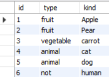

# CASE문, TOP(RANK)동률처리 이슈

생성일: 2021년 11월 25일 오후 10:46

- CASE문
    - MySql 4.0이상에서 사용가능하다.
    - Query 구문에서 Switch or IF문과 같은 조건문을 사용하여 결과값을 내야하는 경우 사용한다.
    
    테스트를 진행하기 위해서 테이블 생성 및 데이터값을 넣어주었습니다.
    
    ```sql
    CREATE TABLE `test` 
    ( `id` int(1) unsigned NOT NULL, `number` int(1) unsigned NOT NULL, 
    `kind` varchar(200) NOT NULL, PRIMARY KEY (`id`) ) 
    DEFAULT CHARSET=utf8;
    
    INSERT INTO `test` (`id`, `number`, `kind`) 
    VALUES ('1', '1', 'Apple'), 
    ('2', '1', 'Pear'), 
    ('3', '2', 'carrot'),
    ('4', '3', 'cat'), 
    ('5', '3', 'dog'), 
    ('6', '4', 'human');
    ```
    
    ```sql
    select id ,(
    	CASE 
    		WHEN number = 1 THEN 'fruit'
    		WHEN number = 2 THEN 'vegetable'
    		WHEN number = 3 THEN 'animal'
            ELSE 'not'
            END)as type , kind
    from test
    ```
    
    
    
- TOP
    
    질의 결과 튜플 수의 제한하는 함수입니다 하지만 MS-SQL에서 지원하는 함수입니다.
    
    - MySql에서는 비슷한 함수로는 LIMIT이 있습니다.
    
- RANK()
    - 랭킹이 동률일 경우 다음 랭킹이 다음 숫자로 넘어가는게 아니라 동률인 랭킹수를 제외한 숫자로 넘어가게 된다.
    
    ```sql
    select *, rank() over(order by value asc) as ranking from item order by value;
    ```
    
    
    
- dense_rank()
    - 랭킹이 도률이라고 가정할때 다음 랭킹은 다음 숫자로 랭킹을 매기게 된다.
    
    ```sql
    select *, dense_rank() over(order by value asc) as ranking from item order by value;
    ```
    
    