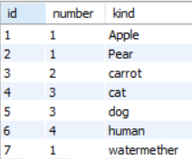

# MERGE 이해

생성일: 2021년 11월 25일 오후 10:44

Merge란 key에 해당하는 데이터가 없으면 insert 있으면 update 하는 기능이다.

Mysql에는 Merge라는 기능이 없지만 그와 비슷한 기능이 있습니다. 

```sql
INSERT INTO TB1(컬럼명) values (값)
ON DUPLICATE KEY -- PK 컬럼명에 중복이 들어올 시 
UPDATE 컬럼명 = 값; -- 중복 컬럼의 ROW를 UPDATE
```

테스트는 전에 사용했던 test테이블 활용해서 테스트를 진행했습니다.

```sql
insert into test(id,number, kind) values(7,1,'watermether')
on duplicate key 
update id = 8, number = 1, kind = 'strawberry';
```



