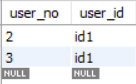

# SEQUENCE 개체 이해

생성일: 2021년 11월 30일 오후 10:59

Sequence

- 보통 RDB에서 PK는 각테이블에서 Auto_increment 조건이 걸려있는 id값을 활용하는 경우가 많다.
하지만 정규화가 점차 늘어나고 테이블이 늘어나면 여기저기서 id컬럼으로 PK를 활용하기에 관리 포인트가 많아지면 어떤 테이블의 id값인지 구별하기가 힘들어질 수 있다.
- id컬럼 대신 해당 테이블에 관련된 String을 포함한 Sequence를 만들어서 관리하면, 테이블의 PK를 한눈에 구별 및 식별하여 관리하기 용이하다.

```sql
create table sequenceEx(
name varchar(255),
currval int );

-- 시퀀스 생성
DELIMITER $$
	CREATE PROCEDURE `create_sequence` (IN the_name text)
    MODIFIES SQL DATA
    DETERMINISTIC
    BEGIN
		DELETE FROM sequenceEx where name  = the_name;
        INSERT INTO sequenceEx VALUES(the_name , 0);
	END;
    
    -- 생성한 시퀀스의 다음값을 가져오는 함수 생성
    DELIMITER $$
	CREATE FUNCTION `nextval` (the_name varchar(255))
	RETURNS int 
    MODIFIES SQL DATA
    DETERMINISTIC
    BEGIN
		DECLARE ret int;
        UPDATE sequenceex set currval = currval +1 where name  = the_name;
        SELECT currval INTO ret FROM sequenceex WHERE name  = the_name LIMIT 1;
		RETURN ret;
	END;
    
    insert into user_info values ( (select nextval('Test') from dual), 'id1');
```



1. Trigger 방식
    - Mysql Trigger 만들어서 LAPD함수의 인자로 원하는 문자열과 Sequence 테이블의 id값을 넣어 자동문자열 시퀀스를 만든다.